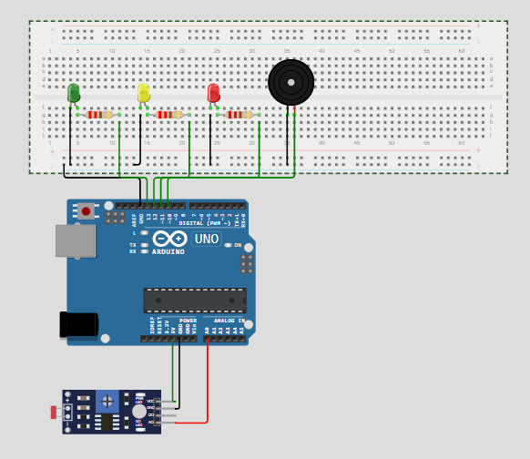

<h1>Checkpoint 01 Edge Computing and Computer Systems - Lucas Demetrius Augusto</h1>

<h3>Sobre o Projeto 💡</h3> 

Nosso projeto é um sistema de monitoramento de luminosidade de uma vinícola, onde precisamos que a iluminação seja controlada para que os vinhos não estraguem. Utilizamos um LDR (Light Dependent Resistor) conectado a um arduino, assim conseguimos ligar três leds, sendo eles: Vermelho, quando a luminosidade estiver acima do normal, Amarelo, para avisar sobre a luminosidade e Verde, quando a luminosidade estiver perfeita para o ambiente. Ele foi desenvolvido usando a linguagem C.

<h3>Equipamentos e montagem 🛠️</h3>

Utilizaremos o Arduino Uno e uma breadboard, para nos auxiliar na realização do projeto.

Utilizaremos três leds, um verde com o cátono na posição F4 e com o ânodo no F5 , um vermelho cátono na posição F24 e com o ânodo no F25 e um amarelo cátono na posição F14 e com o ânodo no F15.

Utilizarremos um sensor de luminosidade com o ldr1:VCC conectado por um jumper no pin 5V, o GND conectado ao GND do arduino e o lrd1:A0 no pin A0.

Utilizaremos 3 resistores de 220Ω, na hora de conectar, encaixe eles horizontalmente. O primeiro está conectado embaixo do ânodo do led verde (G11), o segundo está logo abaixo do ânodo do led amarelo (G21) e o último, no âdono do led vermelho (G31).

Utilizaremos 9 jumpers machos no breadboard.

<ul>
  <li>O primeiro é o do GND, esse jumper é conectado no pin GND do arduino e na primeira entreda negativa no breadboard.</li>
  <li>Conecte um jumper embaixo do cátono em cada LED. Um no G4, o segundo no G14 e o último no G24. Conecte todos na mesma linha do GND</li>
  <li>Agora, adicione um jumper na ponta solta de cada resistor. O primeiro vai conectar na posição H11 e no pin 13. O jumper do resistor do led amarelo vai conectar na posição H21 e no pin 12. O último vai ficar na posição H31 conectado no pin 11</li>
  <li>Os últimos 2 são no buzzer. Adicione um embaixo do cátono na posição H35, e conecte na linha do GND. Adicione outro jumper no âdono na posição H36, e conecte no pin 10 do arduino</li>
</ul>

Utilizaremos um buzzer com o cátono na posição G35.

Se tiver alguma dúvida de como montar, acesse <a href="https://wokwi.com/projects/428328074372035585">projeto de exemplo</a>

<h2>Wokwi - Simulação</h2>

####

<h3>Passo a Passo 📋</h3>

<ul>
  <li>
    
Acesse o site <a href="https://wokwi.com">Wokwi</a>.

  </li>
  <li>
    
Clique em "Arduino (Uno, Mega, Nano)".

  </li>
  <li>
    
Procure por "Arduino Uno" e clique.

  </li>
  <li>
    
Adicione todos os equipamentos listados acima.

  </li>
  <li>
    
Copie e cole o código do arquivo (x).

  </li>
  <li>
    
Compile e rode o código.

  </li>
</ul>

